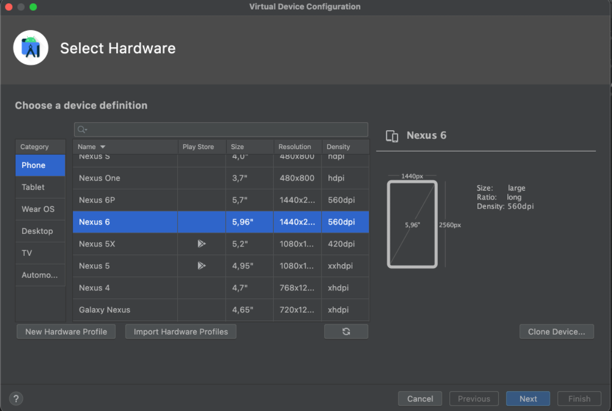
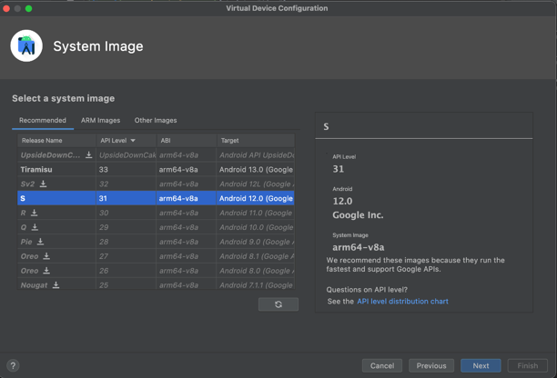
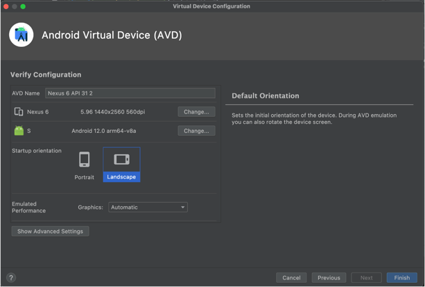

# RATATTACK - Project in TDT4240 Software Architecture

{:height="10px"}

## Installation 
To run the application you will need Android Studio (or a similar IDE). 

### Cloning the project
clone the project to a folder of your choosing:

<pre><code id="git-clone-command">git clone https://gitlab.stud.idi.ntnu.no/ingval/ratattack.git</code></pre>
<button class="btn" data-clipboard-target="#git-clone-command"></button>

Open Android Studio and choose Open an existing Android Studio project. Navigate and choose the cloned project.

## Compiling and running

To run the application you can either connect an Android device or use an Android emulator. Make sure that the device or emulator has an Android version with API lower than or equal to 33. 

### Running on Android device
#### Conneting trough USB-cable
-  Connect your Android device to your computer via USB cable. Make sure that your device has developer mode enabled and USB debugging enabled.

- Open the project in Android Studio. Sync the project with gradle and build the project.

- After clicking allowing USB debugging, your device will automaticallly pop up in "Running devices".

- Run the project. Once the application has been installed, it will automatically launch on your device. You can now use the application on your Android device.

#### Connecting trough Wi-Fi
- Make sure that your computer and device are connected to the same Wi-Fi.

- Open the project in Android Studio. Sync the project with gradle, build and run the project. 

- Click on "Pair Devices Using Wi-Fi" in the drop-down menu for running configurations. The "Pair Devices Using Wi-Fi" dialog will then pop up.

- On your device, go to Developer options and the Debugging section. Turn on "Wireless debugging". An "Allow wireless debugging on this network?" popup will then appear. Click "Allow".

- You can either connect your device using a QR-code or a pairing code. To connect using QR-code, simply scan the code on your computer. To connect using a pairing code, enter the 6-digit code on you computer. The code is visible on your device. Your device will automatically pop up in "Running devices".

- Run the project. Once the application has been installed, it will automatically launch on your device. You can now use the application on your Android device.

### Running with emulator

- Open the AVD manager in the top drop down menu.
- Choose Device Manager, then click on "Create device".
- Select a hardware, for exampel Nexus 6 and press next.

{:height="10px"}

- Select a system image with API level 31 or higher and press next.

{:height="10px"}

- Choose landscape and press finish.

{:height="10px"}

## Structure
The project are structure as shown in the tree below.
<pre> 
.
├── android                 
├── core                                   
├── desktop                    
├── gradle Scripts
└── README.md
</pre>

### Android folder
The Android folder contains the files *AndroidinterfaceClass* and *AndroidLauncher* wich contains logic for connecting to the realtime firebase database. The same folder also contains the *assets* folder, with images used in the design of the application. 

### Core folder
<pre> 
.
├── ...
├── core                    
│     └── ....
│           ├── backend
├── ...     ├── gamecontroller
│           ├── model            
            ├── view
            ├── GameSettings
            └── RatAttack
</pre>
The *core* folder contains the folders *backend*, *gamecontroller*, *model* and view in addition to the files *GameSettings* and *RatAttack*. The *backend* folder contains logic for fetching and submitting scores to the database.

The files are structured according to the Model-View-Controller pattern. The model and view folders are structured as shown in the tree below. The logic for the buttons used to play the game is placed in the buttons folder. The components are also placed in a seperate folder. The strategy pattern logic, which is used to control the different types of bullets, is placed in the *ShootingStrategy* folder. The different systems such as the collision- and the rendersystem is placed in the *system* folder. 

VIEW Rebecca

<pre> 
.      ...
└── ... ├──model 
       ...  ├── buttons                 
            ├── components     
            ├── shootingStrategy            
            ├── system
            └── ...
        
</pre>

## Known errors
During testing we discovered that a ConccurrentModificationException occurs once in a while when going from Gamescreen to Highscorescreen. The error is most likeley caused by the fact that the highscorelist can be modified while iterating over it in the render method in highscorescreen. Due to the time limit and that the error occurs rarely, fixing the error has not been prioritized. We believe that the problem can be fixed by creating a copy of the linked list. We have tried to fix the error by iteariting over a copy of the list instead of the list itself, but are not quite sure if it worked.

## Developed by:
- Ingebjørg Semb Tørresen
- Ingvild Almåsbakk
- Eva Anette Johansen
- Tuva Langedal Djupvik
- Marthe Thorbjørnsen
- Rebecca Ljøen Strandkleiv
